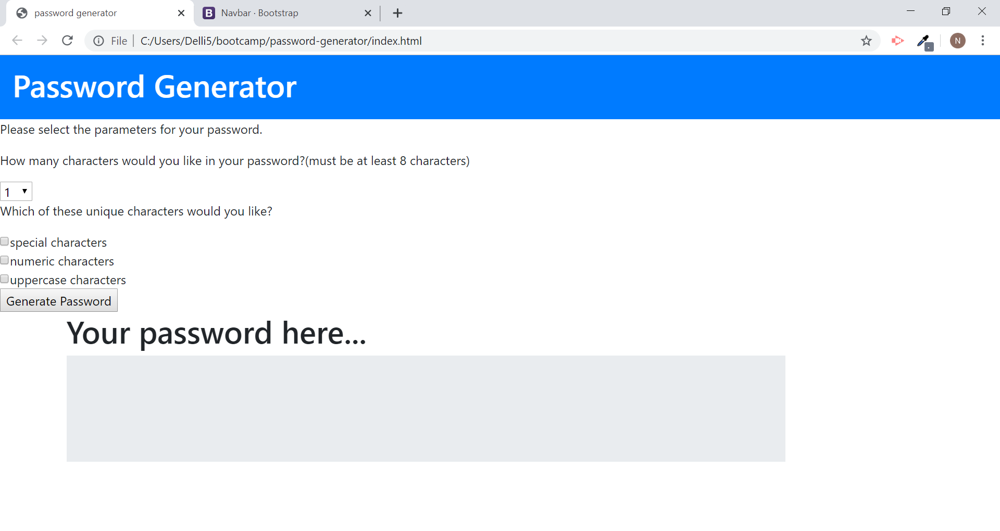

# password-generator
    Passwords are everywhere on the web and the stronger the password the more secure you feel.
This app will generate a random password for you with your parameters.
The javascript in this app is simple but effective. I had the most difficulties with the dropdown selector
changing along with the value in the script. I solved the problem by adding all the numbers in the selector
and adding an alert that forces the user to have at least 8 characters.

